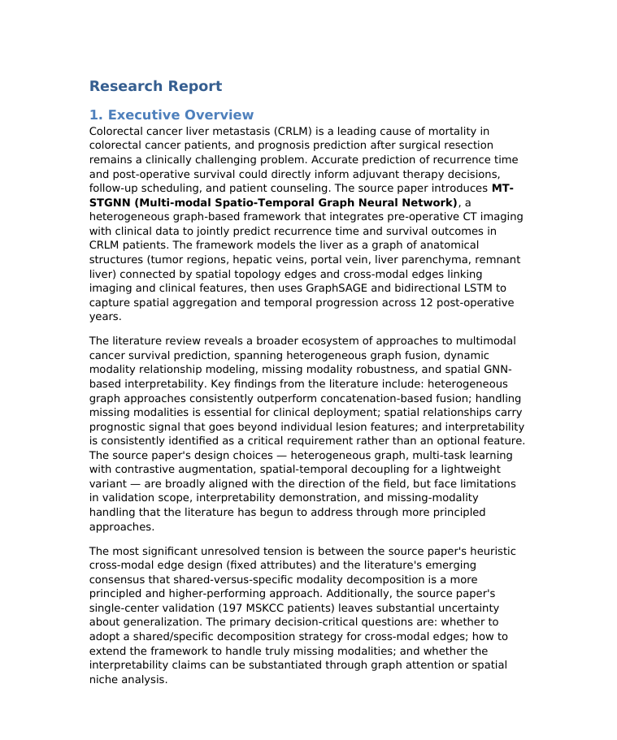

<p align="center">
  
</p>


<h2 align="center"><b>Start Any Research in One Claw. 🦞</b></h2>

<p align="center">
  <strong>From real materials to reports with a fully autonomous & skill-driven researcher.</strong>
</p>

---

<p align="center">
  
</p>


OneResearchClaw is a **multi-format input → research report generation pipeline** designed for real-world workflows.  
It supports starting from meeting audio/video, documents, tables, PPT files, ZIP mixed-material packages, and arXiv / YouTube / Bilibili links, then progressively completes content grounding, literature research, quality review, skill evolution, and multi-format export.

<p align="center">
  <a href="LICENSE"></a>
  <a href="https://python.org"></a>
  <a href="https://github.com/gaotiexinqu/OneResearchClaw"></a>
  <a href="https://github.com/gaotiexinqu/OneResearchClaw#-citation"></a>
  <a href="#star-history"></a>
</p>

<p align="center">
  <a href="./README_CH.md"><b>🌐 中文 README</b></a> ·
  <a href="https://weiyang209.github.io/OneResearchClaw/"><b>🖥️ Project Page</b></a> ·
  <a href="#-showcase"><b>🎬 Showcase</b></a> ·
  <a href="#-quick-start"><b>🚀 Quick Start</b></a> ·
  <a href="#-skills-catalog"><b>🧩 Skills Catalog</b></a>
</p>


---

## 🎬 Showcase

<table>
  <tr>
    <td width="180" align="center">
      
    </td>
    <td>
      <h3>Generated Report Showcase</h3>
      <p>
        5 representative cases across meetings, documents, mixed archives, links, and review workflows —
        showing <b>multi-topic splitting</b>, <b>controllable research depth</b>,
        <b>review-rewrite improvement</b>, and <b>multi-format delivery</b>.
      </p>
      <p>
        <a href="docs/showcase/SHOWCASE.md"></a>
        <a href="docs/showcase/SHOWCASE.md#case-overview"></a>
      </p>
    </td>
  </tr>
</table>


---

## 🔥 News

- **[2026/04/13] Skill-Evolve is officially released**: OneResearchClaw now supports continuous skill-set evolution based on user feedback, saving personalized preferences as selectable derived versions so the automation pipeline can gradually adapt to the way you work.

- **[2026/04/12] One-click cloud link ingestion**: Whether the input is an arXiv paper, a YouTube video, or Bilibili content, simply paste the link and the system will automatically download it locally and start the research workflow.

- **[2026/04/11] Multi-model Review mechanism**: The Review → Rewrite loop supports bounded iterative revision, significantly improving the quality of final deliverables.

- **[2026/04/09] Controllable Research depth**: Choose from `simple / medium / complex`. Whether you need a quick first pass or a deeper research run, the depth and resource usage are easier to control.

- **[2026/04/08] Multi-topic parallel execution**: The system can automatically identify multiple topics in a meeting and generate independent reports. Even dense group meetings can be preserved in a complete and structured way.

- **[2026/04/05] OneResearchClaw released**: From meeting recordings to PDFs, from tables to ZIP packages, real materials are scattered across formats and locations. Normally, you need to manually connect keyword extraction, research, and summarization across workflow stages. OneResearchClaw solves this problem: input files in different formats, then automatically perform structuring, keyword extraction, deep research, content synthesis, and multi-format report export. Reports are now one command away, without manual handoffs.

---

## ✨ Core Highlights

| Core Capability                            | Description                                                  |
| ------------------------------------------ | ------------------------------------------------------------ |
| 🧭 **Unified Multi-source Input**           | Supports many types of materials, from meeting recordings to PDFs, from tables to ZIP packages. The system automatically identifies the material type and routes it to the corresponding grounding skill, reducing manual organization, conversion, and preprocessing costs. |
| 🧠 **Multi-Topic Meeting Splitting**        | For long meetings, complex discussions, or multi-issue materials, the system can automatically split content into multiple topics and generate independent research branches. Each topic can separately go through grounding, research, summary, and export, making it suitable for producing multiple focused reports from one complex meeting. |
| 🎚️ **Controllable Research Depth**          | Supports `simple / medium / complex` research modes to control literature search, source opening, evidence organization, and report analysis depth. It can generate a quick briefing or a more complete research report. |
| 🔎 **Query Confirmation & Directed Search** | Before formal retrieval, the system first generates candidate queries based on the grounded note and supports user confirmation, addition, deletion, or modification. This makes literature search better aligned with the user's real research direction and reduces irrelevant retrieval and token waste. |
| 🧪 **Multi-model Review Mechanism**         | After report generation, the report enters a review → rewrite loop. Different models or review perspectives can check completeness, evidence consistency, logical coherence, and over-claiming, then revise the report through bounded rounds. |
| ☁️ **One-click Cloud Link Ingestion**       | Supports cloud link ingestion and processing for sources such as arXiv, YouTube, and Bilibili, allowing online materials to enter the same research pipeline directly. |
| 📦 **Multi-format Export**                  | Supports exporting final results as `md / docx / pdf / pptx / audio`, covering reading, archiving, presentation, and reuse scenarios, with both Chinese and English export supported. |
| 🧬 **Skill-Evolve**                         | Supports evolving skill subsets based on user feedback through feedback collection, patch generation, regression checks, and version promotion, so the system can continue improving rather than staying fixed as a one-off hand-written workflow. |

---

## 🎯 Typical Use Cases

- 🎙️ Turn meeting audio / video into topic-level reports.
- 📄 Integrate papers, documents, tables, PPT files, and other existing materials into one unified research report.
- 🗂️ Automatically unpack ZIP mixed-material packages and synthesize them into a comprehensive report.
- 🔗 Start content retrieval and analysis from arXiv / YouTube / Bilibili links.
- 📚 Supplement grounded content with literature search and related work analysis.
- 🧪 Improve report quality through a review loop.
- 🧬 Use Skill-Evolve to turn personalized preferences into a new skill subset.
- 📦 Export results as Markdown / DOCX / PDF / PPTX / Audio.

---

## 🚀 Quick Start

### 1. Clone the repository

```bash
git clone <your-repo-url>
cd OneResearchClaw
```

### 2. Install dependencies

```bash
pip install -e .
```

Optional capabilities can be enabled by module:

```bash
pip install -e ".[audio]"
pip install -e ".[document]"
pip install -e ".[export]"
pip install -e ".[table]"
pip install -e ".[api]"
pip install -e ".[full]"
```

### 3. Run in Cursor

Start from the entry skill, for example:

```text
.cursor/skills/one-report/SKILL.md
```

A minimal example prompt:

```text
Please use the existing `.cursor/skills/one-report/` skill to generate a full report from one input file.

First read:
- `.cursor/skills/one-report/SKILL.md`

Input:
- input_path: docs/showcase/inputs/case5/HER2-case5.zip
- output_formats: pdf
- research_mode: complex

Search settings:
- search_backend: cursor
- require_open_link: true
- download_opened_literature: true

Optional:
- output_lang: zh
- transcription_language: zh
```

<details>
<summary><b>📂 Expand: Case 5 full execution path and key intermediate artifacts</b></summary>


Below, **Showcase Case 5 · Mixed Materials → Bilingual Final Delivery** is used as an example to show the main stages of a `one-report` pipeline run, from a ZIP mixed-material input to the final PDF.  
For easier verification, key intermediate artifacts are placed under `docs/showcase/reports/readme_case/`. The file names mentioned below can be clicked to view the corresponding artifacts.

---

### Case Configuration

| Config Item                | Current Value                               |
| -------------------------- | ------------------------------------------- |
| Input material             | `docs/showcase/inputs/case5/HER2-case5.zip` |
| Input type                 | ZIP mixed-material package                  |
| Research mode              | `complex`                                   |
| Search backend             | `cursor`                                    |
| Require opened sources     | `require_open_link: true`                   |
| Download opened literature | `download_opened_literature: true`          |
| Output language            | `zh`                                        |
| Output format              | `pdf`                                       |
| Showcase ground id         | `archive-HER2-case5_20260415130231`         |

---

### 1. Input Routing: Identify the input type

`one-report` first reads `input_path`, detects that the input is a ZIP mixed-material package, and routes the task to the archive grounding workflow.

This stage unpacks the material package, enumerates internal files, and records which grounding skill each file is routed to.  
You can inspect [`manifest.json`](docs/showcase/reports/readme_case/grounded_notes/archive-HER2-case5_20260415130231/manifest.json) and [`routed_items.json`](docs/showcase/reports/readme_case/grounded_notes/archive-HER2-case5_20260415130231/routed_items.json) to see how the input materials are identified and routed.

---

### 2. Grounding: Structure mixed materials

The grounding stage converts different files inside the ZIP package into structured content that can be used by later `research`, `summary`, and `review` stages.

The most important artifact is [`grounded.md`](docs/showcase/reports/readme_case/grounded_notes/archive-HER2-case5_20260415130231/grounded.md).  
It summarizes the input material's themes, key information, researchable questions, and context needed for report generation.

To further inspect the processing result of each individual file inside the ZIP package, open the [`child_outputs/`](docs/showcase/reports/readme_case/grounded_notes/archive-HER2-case5_20260415130231/child_outputs/) directory.  
The README does not need to expand these child outputs one by one; they mainly show that different files inside the mixed-material package are grounded separately and then aggregated into the main `grounded.md`.

---

### 3. Query Generation: Generate and confirm retrieval queries

The research stage does not start searching immediately. Instead, it first generates candidate queries based on `grounded.md`.  
Users can confirm, add, delete, or modify queries before formal retrieval, reducing irrelevant search and token waste.

Two files are worth checking at this stage:

- [`queries.json`](docs/showcase/reports/readme_case/lit_inputs/archive-HER2-case5_20260415130231/queries.json): candidate queries generated from the grounded note;
- [`queries_confirmed.json`](docs/showcase/reports/readme_case/lit_inputs/archive-HER2-case5_20260415130231/queries_confirmed.json): the confirmed queries that actually enter the retrieval stage.

This step reflects OneResearchClaw's **directed research** capability: calibrate the search direction first, then spend retrieval, source-opening, and reading costs.

---

### 4. Literature Research: Retrieve, open sources, and organize evidence

Under `complex` research mode, the system performs a deeper literature research process.  
Because the current settings are:

```text
require_open_link: true
download_opened_literature: true
```

the system does not rely only on search snippets. It tries to open sources, preserve evidence, and download opened literature for later verification.

At this stage, you can inspect:

- [`search_results.json`](docs/showcase/reports/readme_case/lit_inputs/archive-HER2-case5_20260415130231/search_results.json): records retrieval results;
- [`opened_sources/`](docs/showcase/reports/readme_case/lit_inputs/archive-HER2-case5_20260415130231/opened_sources/): stores the contents of sources that were actually opened;
- [`opened_paper_notes.jsonl`](docs/showcase/reports/readme_case/lit_inputs/archive-HER2-case5_20260415130231/opened_paper_notes.jsonl): aggregates paper-level notes;
- [`lit_initial.md`](docs/showcase/reports/readme_case/lit_inputs/archive-HER2-case5_20260415130231/lit_initial.md): the initial literature research result;
- [`manifest.json`](docs/showcase/reports/readme_case/lit_downloads/archive-HER2-case5_20260415130231/manifest.json): records literature download status.

Finally, the research stage generates [`lit.md`](docs/showcase/reports/readme_case/lit_results/archive-HER2-case5_20260415130231/lit.md).  
This is the most important external literature basis for the later summary stage, combining queries, opened sources, paper notes, and research conclusions.

---

### 5. Summary: Integrate grounded note and literature result

The summary stage reads [`grounded.md`](docs/showcase/reports/readme_case/grounded_notes/archive-HER2-case5_20260415130231/grounded.md) and [`lit.md`](docs/showcase/reports/readme_case/lit_results/archive-HER2-case5_20260415130231/lit.md), then generates the first report draft.

The goal of this stage is not to compress the materials into a few bullet points, but to integrate the original materials and literature research results into a structured research report.  
The corresponding artifact is [`summary.md`](docs/showcase/reports/readme_case/report_inputs/archive-HER2-case5_20260415130231/summary.md).

---

### 6. Review → Rewrite: Quality check and bounded revision

After the initial report is generated, it can enter the review → rewrite loop.  
The reviewer checks topic alignment, coverage, evidence specificity, analytical depth, structure coherence, and deliverability. The writer then revises the report according to the reviewer's repair actions.

At this stage, you can inspect:

- [`review_history.json`](docs/showcase/reports/readme_case/review_outputs/archive-HER2-case5_20260415130231/review_history.json): records multi-round review / rewrite history;
- [`review_report.md`](docs/showcase/reports/readme_case/review_outputs/archive-HER2-case5_20260415130231/review_report.md): the final review report;
- [`review_state.json`](docs/showcase/reports/readme_case/review_outputs/archive-HER2-case5_20260415130231/review_state.json): the final review state;
- [`round_0/`](docs/showcase/reports/readme_case/review_outputs/archive-HER2-case5_20260415130231/round_0/), [`round_1/`](docs/showcase/reports/readme_case/review_outputs/archive-HER2-case5_20260415130231/round_1/), [`round_2/`](docs/showcase/reports/readme_case/review_outputs/archive-HER2-case5_20260415130231/round_2/): detailed records for each review round.

When the review reaches the passing condition, the system generates the final report: [`research_report.md`](docs/showcase/reports/readme_case/reports/archive-HER2-case5_20260415130231/research_report.md).  
All downstream export formats are based on this reviewed final report, not on the initial summary draft.

---

### 7. Export: Generate the final PDF

The export stage reads [`research_report.md`](docs/showcase/reports/readme_case/reports/archive-HER2-case5_20260415130231/research_report.md) and exports the requested format according to `output_formats` and `output_lang`.

The current example is configured as:

```text
output_formats: pdf
output_lang: zh
```

So it generates a Chinese PDF report: [`zh/report.pdf`](docs/showcase/reports/readme_case/final_outputs/archive-HER2-case5_20260415130231/zh/report.pdf).  
An English version is also kept in the showcase: [`en/report.pdf`](docs/showcase/reports/readme_case/final_outputs/archive-HER2-case5_20260415130231/en/report.pdf).

</details>


> **Tip: Pipeline behavior can be controlled through entry parameters.**  
> Add `key: value` fields to the `one-report` prompt to control input, research depth, retrieval method, review mode, and final export format.
>
> | Parameter                    | Default     | What it does                                                 |
> | ---------------------------- | ----------- | ------------------------------------------------------------ |
> | `input_path`                 | Required    | Input material path. Supports local files, ZIP mixed-material packages, and local paths produced after cloud-link downloading. |
> | `output_formats`             | Required    | Final export formats. Supports `md / docx / pdf / pptx / audio`, and comma-separated combinations such as `md,pdf,pptx`. |
> | `research_mode`              | `medium`    | Controls research depth. Supports `simple / medium / complex`. This is the core parameter affecting the number of opened papers, retrieval coverage, and token cost. |
> | `research_requirements`      | —           | Additional research preferences, such as emphasizing technical contributions, engineering risks, benchmarks, limitations, or application scenarios. |
> | `search_backend`             | `cursor`    | Literature retrieval backend. Supports `cursor / external / auto`. |
> | `require_open_link`          | `true`      | Whether to require opening and reading sources instead of relying only on search result snippets. |
> | `download_opened_literature` | `true`      | Whether to download opened literature for later verification and paper-note refinement. |
> | `transcription_language`     | `en`        | Language hint for audio / video transcription. It only affects the ASR stage. |
> | `output_lang`                | `en`        | Final report language. For example, `zh` means exporting a Chinese report. |
> | `reviewer_api_config`        | Not enabled | Optional external reviewer configuration. When provided, every round of the review → rewrite loop uses the specified external model as reviewer. |
>
> `research_mode` is automatically mapped to runtime parameters in `config/research_pipeline.env`.  
> The table below shows the current default preset, used to control the literature target range, minimum number of opened papers, and recent-paper requirements. These values are not fixed rules and can be adjusted in the config according to task needs.
>
> | Mode      | Literature Target Range | `MIN_OPENED_PAPERS` | `OPEN_TOP_K` | `MIN_RECENT_PAPERS` |
> | --------- | ----------------------: | ------------------: | -----------: | ------------------: |
> | `simple`  |              3–5 papers |                   3 |            2 |                   2 |
> | `medium`  |             6–10 papers |                   6 |            3 |                   4 |
> | `complex` |            10–15 papers |                  10 |            5 |                   6 |

---

## 🌟 Core Capabilities

### 1. 🧭 Unified Multi-source Input

OneResearchClaw can start a research workflow from many forms of local materials: meeting recordings, paper PDFs, experiment tables, PPT presentation materials, and even ZIP packages containing multiple files. All of them can enter the same automated pipeline.

The system automatically identifies the input type and routes it to the corresponding grounding skill, converting raw materials into structured content usable by the later research, summary, review, and export stages.

| Input Category | Supported Formats              | Typical Content                                       |
| -------------- | ------------------------------ | ----------------------------------------------------- |
| Audio          | `.mp3`, `.wav`, `.m4a`         | Meeting recordings, interviews, voice notes           |
| Video          | `.mp4`, `.mov`, `.mkv`         | Meeting videos, lecture recordings, demo recordings   |
| Documents      | `.pdf`, `.docx`, `.md`, `.txt` | Papers, reports, notes, documentation                 |
| Tables         | `.xlsx`, `.csv`                | Data sheets, experimental results, statistical tables |
| Presentations  | `.pptx`                        | Presentation materials, course slides, project decks  |
| Archives       | `.zip`                         | Multi-file mixed-material packages                    |

---

### 2. 🧠 Multi-Topic Meeting Splitting

In real research and project discussions, a single meeting often contains multiple relatively independent topics: different paper directions, experiment progress, troubleshooting, task planning, or follow-up action items.  
If everything is merged into one context, the generated report can suffer from unclear topic boundaries, cross-topic interference, and bloated structure.

For such long meetings and multi-issue discussions, OneResearchClaw can automatically identify multiple topics in the meeting and split each topic into an independent `grounded unit`.  
Each `grounded unit` keeps the corresponding topic context, key information, and evidence boundary, and can separately enter the research, summary, review, and export workflow.

```text
Meeting Input
audio / video / transcript
        │
        ▼
Meeting Grounding
topic detection + segmentation
        │
        ▼
┌────────────┬────────────┬────────────┐
│ Topic A    │ Topic B    │ Topic C    │
└─────┬──────┴─────┬──────┴─────┬──────┘
      ▼            ▼            ▼
Grounded Unit  Grounded Unit  Grounded Unit
      │            │            │
      ▼            ▼            ▼
Report A      Report B      Report C
```

| Application Need                                             | Processing Method                                            |
| ------------------------------------------------------------ | ------------------------------------------------------------ |
| One meeting contains multiple research directions            | Automatically identify topics and split them into multiple grounded units |
| Different topics require independent research                | Each topic can separately enter the research stage and generate its own literature result |
| Group meetings / interviews / discussions need multiple outputs | One meeting can produce multiple focused reports by topic    |

---

### 3. 🎚️ Controllable Research Depth

Different tasks require different levels of research depth.  
Some scenarios only need quick background supplementation, some require coverage of core related work, while complex research questions require more systematic literature mapping.

OneResearchClaw provides three research depth modes through `research_mode`: `simple / medium / complex`.  
Before running, this parameter is mapped to runtime configuration in `config/research_pipeline.env`, affecting retrieval scope, number of opened sources, recent-paper requirements, and research cost. The specific preset can be found in the Quick Start parameter table and can also be adjusted according to task needs.

| Research Mode | Suitable Scenario                                            |
| ------------- | ------------------------------------------------------------ |
| `simple`      | Quickly understand background and supplement a small amount of core related work; suitable for lightweight briefing or initial exploration. |
| `medium`      | Balance coverage, cost, and report depth; suitable as the default research mode. |
| `complex`     | Suitable for cross-direction, complex problems, or tasks requiring systematic literature mapping; useful for generating deeper research reports. |

During research, the system controls retrieval, source opening, recent-paper requirements, and evidence organization strength according to the current mode.  
For the Cursor-native backend, only sources that are actually opened, read, and saved as local evidence count as valid opened literature. This avoids generating research reports based only on snippet-only search results.

If literature downloading is enabled, the system further downloads opened papers and uses the PDF content to refine paper notes.  
Therefore, the final `lit.md` is not just a search-result summary; it combines queries, opened sources, paper notes, and verifiable materials into a research result.

---

### 4. 🔎 Query Confirmation & Directed Search

High-quality research depends not only on how deep the search goes, but also on whether the search direction is accurate from the beginning.  
In real use, automatically generated queries may be too broad, too narrow, or fail to match the type of literature the user actually needs. For example, the user may need benchmark papers, survey papers, method papers, system papers, or work related to a specific failure mode / limitation.

Therefore, OneResearchClaw adds a query confirmation step before formal literature retrieval: the system first generates candidate queries based on the `grounded note`, then supports user confirmation, addition, deletion, or modification.  
Only confirmed queries enter the later search, source opening, paper notes, and `lit.md` generation workflow.

The core value of this mechanism is that users can calibrate the research direction before research cost is actually spent, focusing the budget on the literature types that matter.

| Query Type           | Main Purpose                                                 |
| -------------------- | ------------------------------------------------------------ |
| `problem_queries`    | Supplement problem background, domain context, benchmarks, and task definitions. |
| `method_queries`     | Retrieve methods, baselines, solutions, and related technical routes. |
| `constraint_queries` | Retrieve risks, constraints, failure modes, data-quality issues, and open problems. |

With query confirmation, users can more directly specify the research focus they need, for example:

```text
Focus more on recent method papers from the last two years
Add benchmark / dataset related queries
Reduce generic survey queries
Supplement failure mode / limitation directions
Focus on a specific application scenario or model architecture
```

This brings two direct benefits:

- **Reduce ineffective retrieval**: avoid queries drifting away from user needs, reducing irrelevant search results and unnecessary source opening;
- **Lower token and time cost**: especially under `medium / complex` research modes, calibrating queries early can significantly reduce later ineffective reading and organization.

Confirmed queries serve as the execution basis for the later research stage.  
Therefore, OneResearchClaw's literature research is a directed research workflow that can be manually calibrated before retrieval.

---

### 5. 🧪 Multi-model Review Mechanism

Automatically generated research reports often still need further checking:  
whether the material coverage is complete, whether the evidence is specific, whether the analysis is deep enough, whether conclusions overclaim, and whether the final content is suitable for delivery.  
OneResearchClaw adds a `review → rewrite` quality loop after summary, enabling structured diagnosis and bounded revision before export.

This stage treats the report as an auditable object and checks it against `grounded.md`, `lit.md`, `summary.md`, and optional paper notes / download manifest for evidence-based quality review.

| Review Dimension                    | What it Checks                                               |
| ----------------------------------- | ------------------------------------------------------------ |
| `topic_alignment`                   | Whether the report stays aligned with the grounded topic and original material requirements. |
| `coverage_completeness`             | Whether it covers important themes, key papers, and main issues in `lit.md`. |
| `evidence_specificity`              | Whether key conclusions are supported by grounded notes, literature results, or opened evidence. |
| `analytical_depth`                  | Whether the report explains why the problem matters, how far the evidence supports the claims, and what uncertainties remain. |
| `structure_and_narrative_coherence` | Whether the report structure is clear, and whether there are repetitions, jumps, or mixed topics. |
| `deliverability`                    | Whether the report is ready for later `md / docx / pdf / pptx / audio` export. |

The review stage supports two reviewer modes:

| Reviewer Mode             | Description                                                  |
| ------------------------- | ------------------------------------------------------------ |
| **Cursor local reviewer** | Uses the reviewer subagent defined in `.cursor/agents/reviewer.md` to review the report locally. |
| **External reviewer API** | When `reviewer_api_config` is provided, external models such as OpenAI or Gemini can be used as reviewers, with the same external reviewer backend maintained across each review round. |

Revision is performed by an independent writer role. The reviewer is responsible for scoring, diagnosis, and repair actions; the writer rewrites the report according to the repair actions specified by the reviewer.  
This role separation makes it easier to connect different models for cross-review and ensures each revision has a clear diagnostic source and repair basis.

Each review round is recorded, making it easier to inspect how the report was modified and how it passed the quality gate. Once the score reaches `>= 90`, the final report can be exported:

```text
data/review_outputs/<ground_id>/
├── round_0/
│   ├── review_report.md
│   └── review_state.json
├── round_1/
│   ├── review_report.md
│   └── review_state.json
├── review_history.json
├── review_report.md
└── review_state.json

data/reports/<ground_id>/
└── research_report.md
```

---

### 6. ☁️ One-click Cloud Link Ingestion

Besides local files, OneResearchClaw can also start report generation directly from remote links.  
When `input_path` is a URL, the system first calls the `remote-input` skill to download or parse the remote material into a local file, then hands it to `input-router` so it can enter the later grounding pipeline according to file type.

This means users can start directly from an arXiv paper, YouTube video, or Bilibili video, without manually downloading, renaming, moving files, or re-specifying downstream processing. Remote materials are first standardized as local inputs, so the later stages still reuse the same `grounding → research → summary → review → export` workflow.

| Remote Source                               | Supported Form                                        | Standardized Result        |
| ------------------------------------------- | ----------------------------------------------------- | -------------------------- |
| 📄 **[arXiv](https://arxiv.org/)**           | `arxiv.org/abs/...`, `arxiv.org/pdf/...`              | Downloaded as a PDF file   |
| 🎬 **[YouTube](https://www.youtube.com/)**   | `youtube.com/watch`, `youtu.be`, `youtube.com/shorts` | Downloaded as a video file |
| 🎬 **[Bilibili](https://www.bilibili.com/)** | `bilibili.com/video/BV...`, `av...`, `b23.tv/...`     | Downloaded as a video file |

---

### 7. 📦 Multi-format Export

OneResearchClaw supports exporting the reviewed final report into multiple deliverable forms, covering editing, archiving, presentation, and audio-browsing scenarios.  
The export stage generates different formats from the same final report, avoiding separate regeneration for each format and preserving version consistency.

Currently supported export formats include:

```text
md / docx / pdf / pptx / audio
```

Among them, `md` is suitable for continued editing and version control, `docx` for formal document delivery and manual editing, `pdf` for stable reading and archiving, `pptx` for presentation, and `audio` for speech-style delivery.

OneResearchClaw also supports controlling the final delivery language through `output_lang`:

```text
output_lang: zh
output_lang: en
```

In other words, the same pipeline can export the final report in either Chinese or English as needed.

---

### 8. 🧬 Skill-Evolve

The main workflow of OneResearchClaw is responsible for generating reports, while `Skill-Evolve` helps the workflow gradually adapt to user preferences during use.

In real use, different users often have different preferences for report style, research depth, structure, citation style, and export behavior.  
If these preferences are repeatedly specified through temporary prompts, they are difficult to preserve and can easily be lost in later tasks. The goal of `Skill-Evolve` is to turn recurring feedback into reviewable, verifiable, and reusable skill modification proposals.

It does not directly overwrite the stable main skill set. Instead, it first generates a patch proposal based on user feedback, then produces a derived skill subset after validation. This preserves the stability of the original workflow while allowing users to maintain customized versions based on their own usage habits.

```text
user feedback → patch proposal → validation gate → derived skill set
```

`Skill-Evolve` mainly supports:

- Analyzing which skill needs adjustment based on user feedback, such as insufficient report depth, mismatched structure, review dimension changes, or export improvements;
- Generating patch proposals for specific skills, rather than only producing a temporary prompt;
- Using regression / validation gates to check whether modifications break the original workflow;
- Producing derived skill subsets that can be selected for future tasks;
- Persisting personalized preferences at the skill level rather than leaving them in a single conversation.

---

## 🧩 Skills Catalog

The table below lists the main skill set in the current repository, grouped by function.

| Skill                     | Description                                                  |
| ------------------------- | ------------------------------------------------------------ |
| `one-report`              | Main entry skill that organizes the full report generation pipeline |
| `input-router`            | Identifies input type and routes the task to the appropriate skill |
| `remote-input`            | Handles remote link inputs such as arXiv / YouTube / Bilibili |
| `archive-grounding`       | Handles ZIP / archive mixed-material packages and aggregates multiple internal contents |
| `document-grounding`      | Handles PDF / DOCX / Markdown / TXT document inputs          |
| `table-grounding`         | Handles XLSX / CSV table inputs                              |
| `pptx-grounding`          | Handles presentation inputs                                  |
| `meeting-grounding`       | Main grounding entry for meeting-type materials              |
| `meeting-audio-grounding` | Audio meeting grounding                                      |
| `meeting-video-grounding` | Video meeting grounding                                      |
| `audio_structuring`       | Audio content structuring, transcription, and segmentation capabilities |
| `grounded-research-lit`   | Runs research based on grounded notes, opens sources, and generates `lit.md` |
| `grounded-summary`        | Integrates grounded content and research evidence to generate a comprehensive report |
| `grounded-review`         | Runs the review → rewrite loop to improve report quality     |
| `report-export`           | Exports final formats such as md / docx / pdf / pptx / audio |
| `skill-evolve`            | Generates patch proposals based on user feedback and builds new skill subsets |

---

## ⭐ Star History

<a href="https://www.star-history.com/?repos=gaotiexinqu%2FOne-Research&type=date&legend=top-left">

 <picture>
   <source media="(prefers-color-scheme: dark)" srcset="https://api.star-history.com/chart?repos=gaotiexinqu/One-Research&type=date&theme=dark&legend=top-left" />
   <source media="(prefers-color-scheme: light)" srcset="https://api.star-history.com/chart?repos=gaotiexinqu/One-Research&type=date&legend=top-left" />
   
 </picture>

</a>

---

## 🙏 Acknowledgements

OneResearchClaw is inspired by several excellent open-source projects and skill-based workflow practices:

- [AutoResearchClaw](https://github.com/aiming-lab/AutoResearchClaw)
- [Auto-claude-code-research-in-sleep](https://github.com/wanshuiyin/Auto-claude-code-research-in-sleep)
- [A-Evolve](https://github.com/A-EVO-Lab/a-evolve)
- [awesome-claude-skills](https://github.com/ComposioHQ/awesome-claude-skills)

We thank the authors and maintainers of these projects for sharing their work with the open-source community.

---

## 📄 License

MIT — see [LICENSE](LICENSE) for details.

---

## 📌 Citation

If you find OneResearchClaw helpful, consider cite us:

```bibtex
@misc{OneResearchClaw2026,
  author       = {Yang, Wei* and Zhao, Yiming* and Zeng, Yu* and Fang, Zhen* and Huang, Wenxuan and Zhang, Ziao and Shi, Kou and Miao, Qing and Chen, Lin and Chen, Zehui and Bao, Xikun},
  title        = {OneResearchClaw: Fully Autonomous, Skill-Driven Research Synthesis from Heterogeneous Inputs},
  year         = {2026},
  organization = {GitHub},
  url          = {https://github.com/gaotiexinqu/OneResearchClaw},
}
```


<p align="center">
  <a href="https://img.shields.io/badge/License-MIT-blue.svg"><a href="https://img.shields.io/badge/Code%20License-MIT-yellow.svg"><a href="https://img.shields.io/badge/Model%20License-CC%20BY--NC--SA%204.0-orange.svg"><a href="https://img.shields.io/badge/Python-3.10%2B-green.svg"><a href="https://img.shields.io/badge/LangGraph-Agentic%20Workflows-purple.svg"><a href="https://github.com/psf/black"></a>
</p>---

<p align="center">
  <sub>Built with <a href="https://cursor.com/cn/get-started?cc_platform=google&cc_campaignid=23639215328&cc_adgroupid=194817004980&cc_adid=799754797082&cc_keyword=cursor&cc_matchtype=b&cc_device=c&cc_network=g&cc_placement=&cc_location=2702&cc_adposition=&gad_source=1&gad_campaignid=23639215328&gbraid=0AAAABAkdGgSYLK4tfnXaSFHBrYgrb-ttX">Cursor</a> by the OneResearchClaw Team</sub>
</p>

